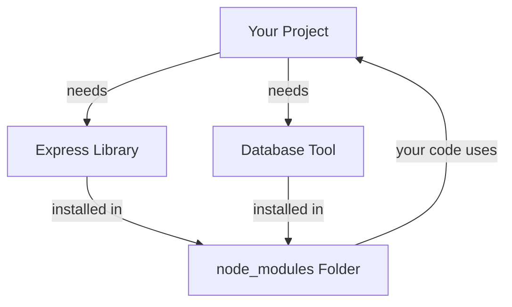

# Vibe Coding Learning Notes for Project 1 (next.js app)
## 0. 📌 Project Objective
**What am I learning?** 
- How to configure the Auth0 tenant 
    - configure a regular web application
    - configure an API
    - configure an auth with PKCE code 
     
**Why am I learning this?** [How it connects to bigger picture]
- After the project objective above is done 
    - [Integrate the MCP for Auth0](https://github.com/auth0/auth0-cli.git) 
    - [Then integrate Auth0 Checkmate](https://github.com/auth0/auth0-checkmate.git)
    - [Then integrate and utilize auth0-CLI](https://github.com/auth0/auth0-cli.git)

**North Star**
> Integrate all of these to the LLM and the IAM MCP Tools and prove that Governance and Monitoring through an AI Driven Policy is possible. 


## 1.  📚 Glossary / Commands
- ```pwd``` ⟹ get absolute path of where you currently in file structure
- ```cp .env.local.example .env.local``` ⟹ Make a copy of the .env.local.example file and name it .env.local"
- ```mv sample/* . 2>/dev/null``` ⟹ Move all files and hidden files (like .env) from 'sample' to '.' (here)
- ```npm install ``` ⟹ package.json contains a 'shopping list' that you will need to invoke downloading using this command
- ```npm run dev ``` ⟹ run this after install is successful.
- ```openssl rand -hex 32``` --> generates a 32 char string provides the AUTH0_SECRET requireid for Auth0 SDK to sign and encrypt cookies safely.


## 2. 🧠 Core Concepts 
| Component | What It Does | Why It Matters |
|-----------|-------------|----------------|
| **VS Code** | Code editor where you write | Where you actually build your project |
| **GitHub** | Stores & tracks your code | Saves your work, shows changes over time |
| **Vercel** | Deploys your project online | Makes your code live on the internet |
| **Auth0 Dashboard** | Manages user logins | Lets users securely sign in to your app |
| **npm** | Manages code libraries | Lets you use other people's code |
| **node_modules** | Stores downloaded libraries | Your project knows where to find them |
| **package.json** | Lists what your project needs | Tells npm what to install |
| **Terminal** | Where you type commands | How you tell the computer what to do |


## 3. 📋 Project 1: my-jmangali-nextjs-full-app
- Date started: March 9th, 2026
- Purpose: This project was taken from sample app github repo [located here](https://github.com/auth0-samples/auth0-react-samples.git).

### 3A. 📋 Project 1: Next.js Project Structure 

| Folder/File | Purpose (WHY) | What It Does (WHAT) | Example/Notes |
|---|---|---|---|
| **app/** | Next.js 13+ routing system | All pages and routes live here. This is where users navigate to different pages | Contains all your page files and API routes |
| **src/** | Separate folder for app logic | All reusable code (not routing). Think of it as your "toolbox" for the app | Contains components, services, hooks, types, styles |
| **public/** | Static files | Images, fonts, SVGs that don't change. Don't put secret stuff here (it's public!) | Logo, icons, favicon, fonts |
| **tests/** | Automated testing | Tests for every major piece. Tests don't ship to production | unit/, integration/, e2e/ |
| **.env.local** | Store secrets locally | API keys, database URLs, tokens. Never commit to git! | MCP_SERVER_URL, API_KEY |
| **.env.example** | Template for env vars | Same as .env.local but with placeholder values. Commit this to git so team knows what's needed | Shows required variables |
| **.gitignore** | Git ignore rules | Tell git what NOT to commit. Ignore node_modules, .env.local, etc | Prevents committing sensitive files |
| **next.config.js** | Configure Next.js | Customizations for your app. Add environment variables, configure builds | Next.js settings and customizations |
| **tsconfig.json** | TypeScript config | Configure TypeScript (if using TypeScript). How TypeScript should compile your code | Path aliases, compiler options |
| **jest.config.js** | Jest config | Configure Jest testing framework. How tests should run | Test settings and configuration |
| **package.json** | Project metadata | Project dependencies and metadata. Lists all npm packages you use | react, next, typescript versions |
| **README.md** | Documentation | Documentation for other developers. How to run the project, what it does | Project overview and setup instructions |

## 4. 🏗️ What We Built — MCP + FGA Integration (March 2026)

### The Big Picture

We extended the Next.js app with a full AI-driven Auth0 tenant management system. Phoenix (the chatbot) can now call real Auth0 Management API actions — but only based on what your role allows, enforced by Auth0 FGA (Fine-Grained Authorization).

```
You (browser)
    ↓
Next.js App (Vercel)
    ↓  your Auth0 access token
Anthropic API (Claude / Phoenix)
    ↓  mcp_servers config — Anthropic connects directly
FastMCP Server (Azure Container Apps)
    ↓              ↓
Auth0 FGA     Auth0 Management API
(can you?)    (actually do it)
```

### Four Roles, Four Sets of Permissions

| Role | User | Can do |
|---|---|---|
| godmode | Jennifer | Everything |
| admin | Monica | Read logs, read apps |
| editor | Rachel | Update branding |
| viewer | Phoebe | Read logs only |

### Pages Added / Changed

| Page | What it does |
|---|---|
| `/askphoenix` | Chat with Phoenix. Now streams real Auth0 tenant data via MCP tools. Brand yellow user bubbles. Full-width assistant messages (better for tables). Shows "fetching from tenant..." hint during tool calls. |
| `/external` → "My Permissions" | Shows a live allow/deny grid of MCP tools for the logged-in user — powered by FGA. Replaces the sample External API page. |
| Home page | Logged-in state now shows only the Yellow Umbrella hero image — no copy. Logged-out state unchanged. |
| NavBar | "External API" renamed "My Permissions". "User Profile" renamed "My Profile". |

### Key Technical Decisions

**Why Anthropic remote MCP (`mcp_servers`) instead of a client-side connection:**
The Next.js route used to open an MCP connection at startup and try to reuse it when Phoenix executed a tool. Vercel serverless functions are stateless — the connection expired silently between those two moments. Switching to `mcp_servers` hands the connection to Anthropic's infrastructure, which dials the MCP server fresh on every tool call. Think: payphone (dies) vs hotel concierge (reliable).

**Why the system prompt doesn't list tool names:**
If the system prompt names tools that FGA has hidden for this user, Phoenix tries to call them anyway and crashes. By removing specific names, Phoenix discovers available tools dynamically from MCP and only calls what's actually there.

**Why `rss.xml` for the Auth0 changelog:**
The `https://auth0.com/changelog` page is JavaScript-rendered — `web_fetch` can't execute JS, so it gets an empty shell. The RSS feed at `/changelog/rss.xml` is static XML and returns real content.

### Auth0 Dashboard Gotcha

`Phoenix-MCP-Auth0Management-Dev` (M2M app) needs **Client Access** authorized for the Auth0 Management API with scopes: `read:logs`, `read:users`, `read:clients`, `update:branding`. User Access is irrelevant for M2M apps. If Client Access is Unauthorized, every tool call fails with "Failed to get management token: Unauthorized".

### Confirmed Working ✅

- Jennifer (godmode) asked "who are the users on my tenant?" → Phoenix returned a formatted table of all 7 users with provider, login count, and last login date — pulled live from the Auth0 Management API.

---

## 5. 🐛 Common Errors & Fixes
(Problems you hit + how you solved them)


----

# Reference Markdown Syntax
> This is a quote or important note

---  (creates a horizontal line)

| Header 1 | Header 2 |
|----------|----------|
| Cell 1   | Cell 2   |


 → displays an image
#### Command/Concept Name
**What I did:** 
**Why I did it:** 
**What happened:** 
**Why it happened:** 
**When to use again:** 
**bold text** → makes text bold
*italic text* → makes text slanted
~~strikethrough~~ → crosses out text
`code snippet` → shows code in a different style
- Item 1
- Item 2
  - Sub-item (use spaces to indent)

[Click here](https://example.com) → creates a clickable link


1. First thing
2. Second thing
3. Third thing


✅ = "this worked"
❓ = "this confused me"
🔧 = "technical stuff"
📚 = "definitions"


### How npm Dependencies Work



**Why this matters:** When you run `npm install`, it downloads libraries and stores them in node_modules. Your project then uses those libraries.


## Core Concepts: Main Components

| Component | What It Does | Why It Matters |
|-----------|-------------|----------------|
| **npm** | Manages code libraries | Lets you use other people's code |
| **node_modules** | Stores downloaded libraries | Your project knows where to find them |
| **package.json** | Lists what your project needs | Tells npm what to install |
| **Terminal** | Where you type commands | How you tell the computer what to do |


→ (arrow right)
← (arrow left)
↑ (arrow up)
↓ (arrow down)
⟹ (double arrow right)
⟵ (double arrow left)
